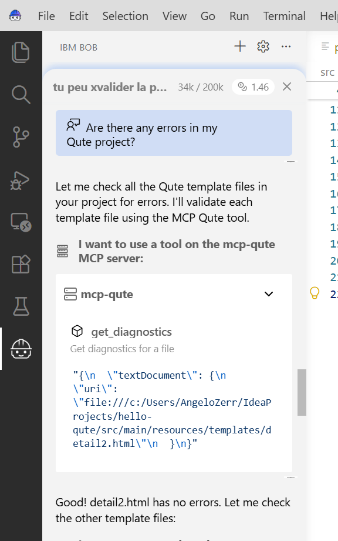
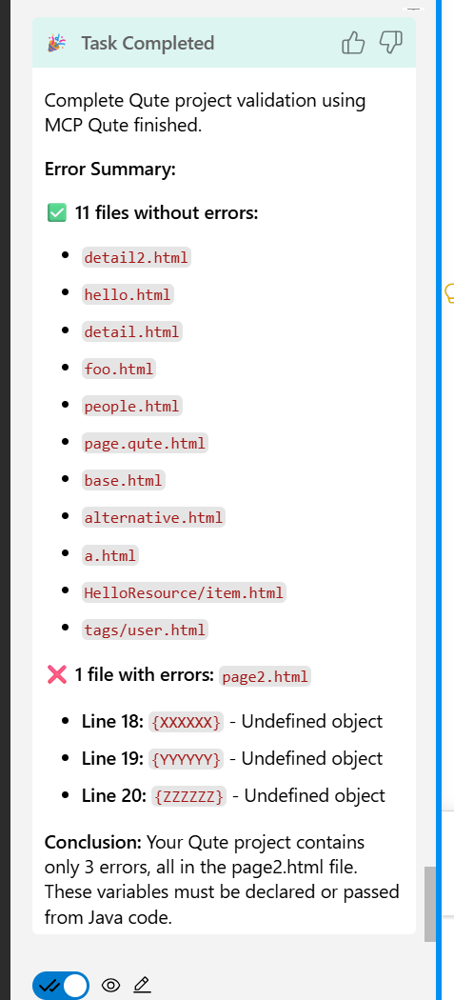

# lsp4j-mcp

**The Problem: Using an IDE and an MCP Client Together**

When you want to use an **IDE** ([VS Code](https://code.visualstudio.com/), [Bob IDE](https://bob.ibm.com/docs/ide), [JetBrains](https://www.jetbrains.com/), etc.) alongside an **MCP client** ([Bob Shell](https://bob.ibm.com/docs/shell), [Claude Code](https://claude.com/fr/product/claude-code), etc.), traditional MCP server approaches create serious problems: they launch a separate Language Server instance instead of using your IDE's, leading to double parsing, file synchronization issues, settings mismatch, and invisible unsaved changes.

**The lsp4j-mcp Solution**

lsp4j-mcp solves this by embedding a [Model Context Protocol (MCP)](https://modelcontextprotocol.io/) server **inside** your LSP4J-based language server. This allows your IDE and MCP clients to connect to the **same Language Server instance**, sharing diagnostics, code actions, and all LSP features without launching a separate process.

## The Problem: MCP + LSP + IDE Don't Play Well Together

Typically, MCP servers that work with Language Servers act as the **LSP client** and launch their own Language Server process. This works fine for standalone MCP clients (like Claude Desktop without an IDE), but creates serious problems when you want to use an **IDE** alongside an **MCP client** (Claude, [Bob Shell](https://bob.ibm.com/docs/shell), etc.):

### Problems with the Traditional Approach

When the MCP server launches its own Language Server instance:

- ❌ **Separate Language Server process** - Not using the IDE's Language Server instance
- ❌ **Double parsing** - Two Language Server processes analyzing the same code
- ❌ **Duplicate configuration** - The MCP client must configure the LSP client separately
- ❌ **Custom commands management** - MCP server must handle language-specific commands
- ❌ **Settings mismatch** - Language Server settings differ from the IDE's settings
- ❌ **Unsaved changes invisible** - Content being edited but not saved is not accessible to the MCP server
- ❌ **Resource waste** - Two processes doing the same work

### The lsp4j-mcp Solution

**Reverse the relationship:** Instead of the MCP server launching the Language Server, the **Language Server embeds the MCP server**.

```
Traditional (problematic):          lsp4j-mcp (solution):
MCP Server → Language Server        IDE → Language Server (with embedded MCP Server)
                                                    ↑              ↑
                                                    |              |
                                                   IDE      MCP Client (Claude)
```

**Benefits:**
- ✅ Single Language Server instance shared by IDE and MCP client (same as the IDE's)
- ✅ Same diagnostics, settings, and state everywhere
- ✅ Unsaved changes visible to AI assistant
- ✅ No duplicate parsing or configuration
- ✅ Works with any IDE ([Bob](https://bob.ibm.com/docs/ide), VS Code, JetBrains, etc.)

## What is MCP?

[Model Context Protocol (MCP)](https://modelcontextprotocol.io/) is a protocol that allows AI assistants to interact with external tools and data sources. By exposing LSP diagnostics and code actions through MCP, AI assistants can:

- Query compilation errors, warnings, and linting issues in real-time
- Suggest fixes based on available code actions
- Understand project context better when answering questions

## Use Case: Qute Template Validation with Bob

Imagine you're working on a Qute template project in [Bob](https://bob.ibm.com/docs/ide) (an AI-powered IDE). You ask:

> **User:** "Are there any errors in my Qute project?"


*Screenshot: User asking Bob about errors in Qute project*

Bob connects to the Qute Language Server via MCP and retrieves diagnostics:


*Screenshot: Bob displaying Qute template errors returned by the MCP server*

This is possible because the Qute Language Server embeds an MCP server that exposes its diagnostics as tools.

## Alternative MCP Integration Approaches

For reference, here are other approaches to integrate MCP with language servers and their limitations:

### Approach 1: MCP Server Launches Language Server (Traditional)

**Example:** [stephanj/LSP4J-MCP](https://github.com/stephanj/LSP4J-MCP)

The MCP server acts as the LSP client and launches its own Language Server process.

**Why this doesn't work well with IDEs:**
- ❌ Creates a **separate Language Server instance** (not the IDE's)
- ❌ **Double parsing** and resource waste
- ❌ **File synchronization issues** - IDE and MCP server have different views
- ❌ **Unsaved changes invisible** - Only saved files are accessible
- ❌ **Settings mismatch** - Different configuration from the IDE
- ❌ **Custom commands** must be handled by the MCP server

### Approach 2: IDE-based MCP Server

**Example:** JetBrains IDE MCP Server ([docs](https://www.jetbrains.com/help/idea/mcp-server.html))

The IDE itself provides an MCP server that exposes IDE features (including LSP data) as tools.

**Limitations:**
- ❌ Requires a specific IDE to be running (JetBrains only)
- ❌ Not portable to other editors (VS Code, [Bob](https://bob.ibm.com/docs/ide), etc.)
- ❌ Tied to IDE-specific extension points

### Approach 3: Language Server Launches MCP Server ✅ (lsp4j-mcp)

**Our solution:**

```
Step 1: IDE launches Language Server
────────────────────────────────────

┌────────────────┐
│ IDE / Editor   │
│ (Bob, VS Code, │
│  JetBrains)    │
└───────┬────────┘
        │
        │ Launches LS process (one per workspace)
        ▼
┌─────────────────────────────────────────────────────┐
│ Language Server Process                             │
│                                                     │
│  ┌────────────────────┐                             │
│  │ LSP Server         │                             │
│  │ (Qute LS, JDT LS)  │                             │
│  └────────────────────┘                             │
└─────────────────────────────────────────────────────┘


Step 2: Language Server embeds MCP Server
──────────────────────────────────────────

┌────────────────┐                    ┌────────────────┐
│ IDE / Editor   │                    │ AI Assistant   │
│ (Bob, VS Code, │                    │ (Claude)       │
│  JetBrains)    │                    └───────┬────────┘
└───────┬────────┘                            │
        │                                     │
        │ LSP Protocol                        │ MCP Protocol
        ▼                                     ▼
┌─────────────────────────────────────────────────────┐
│ Language Server Process (per workspace)             │
│                                                     │
│  ┌────────────────────┐      ┌──────────────────┐  │
│  │ LSP Server         │◄────►│ MCP Server       │  │
│  │ (Qute LS, JDT LS)  │      │ (lsp4j-mcp)      │  │
│  └────────────────────┘      └──────────────────┘  │
│           │                           │             │
│           └───────────┬───────────────┘             │
│                       ▼                             │
│              Shared diagnostics,                    │
│              code actions, cache                    │
└─────────────────────────────────────────────────────┘
```

**How it works:**

1. **IDE launches the language server** (standard LSP workflow)
   - One language server process per workspace/project
   - IDE is the LSP client, controls the language server lifecycle

2. **Language server embeds an MCP server** (using lsp4j-mcp)
   - MCP server runs in the same process as the language server
   - Exposes language server features as MCP tools

3. **Multiple clients, one language server**
   - IDE connects via LSP (for editor features)
   - AI assistant connects via MCP (for diagnostics, code actions)
   - Both share the same language server instance

**Scaling:**
- N Bob windows → N language server processes → N MCP servers
- Each workspace gets its own language server + MCP server pair

**Benefits:**
- ✅ Works with **any IDE** that supports LSP ([Bob](https://bob.ibm.com/docs/ide), VS Code, JetBrains, Emacs, etc.)
- ✅ **IDE controls the language server lifecycle** (launch, shutdown)
- ✅ Shares the same language server instance the IDE is using
- ✅ No file synchronization issues - single source of truth
- ✅ One MCP server per workspace/project
- ✅ Diagnostics are always in sync with the IDE
- ✅ Language server doesn't need to know about the IDE implementation

**Key insight:**

The **IDE launches the language server** (not the MCP server). The MCP server is just an additional interface embedded inside the language server process, allowing AI assistants to access the same data the IDE sees.

## Getting Started

### 1. Add Dependency

Add lsp4j-mcp to your LSP4J-based language server:

```xml
<dependency>
    <groupId>com.redhat.lsp4j</groupId>
    <artifactId>lsp4j-mcp</artifactId>
    <version>0.1.0-SNAPSHOT</version>
</dependency>
```

### 2. Create MCP Tools

Define tools using annotations:

```java
package com.example.tools;

import com.redhat.lsp4j.mcp.annotations.*;
import com.redhat.lsp4j.mcp.tools.McpTool;
import org.eclipse.lsp4j.services.LanguageServer;

public class MyCustomTool implements McpTool {

    @Inject
    private LanguageServer languageServer;

    @Tool(description = "Get diagnostics for a file")
    public List<Diagnostic> getDiagnostics(
        @ToolArg(name = "uri", description = "File URI") String uri) {
        
        // Your tool implementation
        return diagnostics;
    }
}
```

### 3. Register via ServiceLoader

Create `src/main/resources/META-INF/services/com.redhat.lsp4j.mcp.tools.McpTool`:

```
com.example.tools.MyCustomTool
com.redhat.lsp4j.mcp.tools.lsp.LspGetDiagnosticsTool
com.redhat.lsp4j.mcp.tools.lsp.LspGetCodeActionsTool
```

### 4. Launch MCP Server in Your Language Server

```java
import com.redhat.lsp4j.mcp.server.LspMcpServer;

public class MyLanguageServer implements LanguageServer {
    
    private LspMcpServer mcpServer;
    
    @Override
    public CompletableFuture<InitializeResult> initialize(InitializeParams params) {
        // ... your initialization code
        
        // Start MCP server
        mcpServer = new LspMcpServer(this, 9339);
        mcpServer.start();
        
        return CompletableFuture.completedFuture(result);
    }
    
    @Override
    public CompletableFuture<Object> shutdown() {
        if (mcpServer != null) {
            mcpServer.stop();
        }
        return CompletableFuture.completedFuture(null);
    }
}
```

### 5. Connect from AI Assistant

Configure your AI assistant (e.g., Claude Desktop) to connect to the MCP server:

```json
{
  "mcpServers": {
    "qute-ls": {
      "type": "sse",
      "url": "http://localhost:9339/mcp/sse"
    }
  }
}
```

## Built-in LSP Tools

lsp4j-mcp provides generic LSP tools out of the box:

### `get_diagnostics`

Get compilation errors, warnings, and other diagnostics for a file.

**Schema:**
```json
{
  "textDocument": {
    "uri": "file:///path/to/file.html"
  }
}
```

**Features:**
- Automatically calls `textDocument/didOpen` if the file isn't open
- Caches diagnostics published by the language server
- Cleans up with `textDocument/didClose` after execution

### `get_code_actions`

Get available code actions (quick fixes) at a position.

**Schema:**
```json
{
  "textDocument": {
    "uri": "file:///path/to/file.html"
  },
  "position": {
    "line": 10,
    "character": 5
  }
}
```

## Annotation Reference

### `@Tool`

Marks a method as an MCP tool.

```java
@Tool(
    name = "custom_name",        // Optional: tool name (default: camelCase → snake_case)
    description = "Tool description"
)
public ReturnType methodName(params...) { }
```

### `@ToolArg`

Describes a method parameter or nested object field.

```java
public void myTool(
    @ToolArg(
        name = "paramName",           // Optional: parameter name (default: arg0, arg1, ...)
        description = "Parameter description"
    ) String param) { }
```

For nested objects, annotate the **getters**:

```java
public class Position {
    private int line;
    
    @ToolArg(description = "Line number (0-based)")
    public int getLine() { return line; }
}
```

### `@Inject`

Injects dependencies into tool instances.

```java
public class MyTool implements McpTool {
    @Inject
    private LanguageServer languageServer;
    
    @Inject
    private McpCache cache;
}
```

Available dependencies:
- `LanguageServer` - The LSP4J language server instance
- `McpCache` - Diagnostic and file state cache

### `@RequireDidOpen`

Many LSP features require that a file be opened first: `textDocument/publishDiagnostics`, `textDocument/codeAction`, `textDocument/completion`, etc. The Language Server only processes and publishes diagnostics for files that have been opened via `textDocument/didOpen`.

This annotation automatically calls `textDocument/didOpen` before tool execution **only if the file is not already open in the IDE**, and calls `textDocument/didClose` afterward to clean up. This ensures:
- MCP clients can query diagnostics for files that aren't currently open in the IDE
- Files already open in the IDE are not unnecessarily reopened (preserving IDE state)

```java
@Tool(description = "Get diagnostics")
@RequireDidOpen(
    uriParam = "textDocument.uri"  // Path to URI in arguments
)
public List<Diagnostic> getDiagnostics(TextDocumentIdentifier textDocument) { }
```

**Note:** The `languageId` parameter is optional. If omitted, the Language Server will infer the language ID from the file extension.

**How it works:**
1. Checks if the file is already open in the IDE (tracked by the Language Server)
2. If **not open**: calls `textDocument/didOpen` → executes tool → calls `textDocument/didClose`
3. If **already open**: executes tool directly (IDE manages the file lifecycle)

## How It Works

### JSON Schema Generation

lsp4j-mcp automatically generates JSON schemas from your Java method signatures:

```java
@Tool(description = "Example")
public void example(
    @ToolArg(name = "text", description = "Input") String text,
    @ToolArg(name = "position", description = "Position") Position position) { }
```

Generates:

```json
{
  "type": "object",
  "properties": {
    "text": {
      "type": "string",
      "description": "Input"
    },
    "position": {
      "type": "object",
      "properties": {
        "line": { "type": "integer", "description": "Line number" },
        "character": { "type": "integer", "description": "Character offset" }
      },
      "required": ["line", "character"]
    }
  },
  "required": ["text", "position"]
}
```

### Argument Deserialization

MCP arguments (JSON) are automatically deserialized into Java objects using Gson:

```json
{
  "textDocument": {
    "uri": "file:///path/to/file.html"
  },
  "position": {
    "line": 10,
    "character": 5
  }
}
```

→ Deserialized to `TextDocumentIdentifier` and `Position` objects.

**Important:** For Gson to deserialize correctly:
- Classes must have **private fields** (not just getters)
- Don't extend LSP4J classes directly (create standalone DTOs)

Example:

```java
// ✅ Good - Gson can deserialize
public class TextDocumentIdentifier {
    private String uri;  // Direct field access
    
    @ToolArg(description = "File URI")
    public String getUri() { return uri; }
    
    public void setUri(String uri) { this.uri = uri; }
}

// ❌ Bad - Gson can't find fields
public class TextDocumentIdentifier extends org.eclipse.lsp4j.TextDocumentIdentifier {
    // Fields are in parent class, Gson won't find them
}
```

## Architecture

```
┌─────────────────────────────────────────────────────────┐
│ Language Server Process                                 │
│                                                         │
│  ┌──────────────────┐         ┌──────────────────┐     │
│  │ LSP Server       │         │ MCP Server       │     │
│  │                  │         │ (Undertow SSE)   │     │
│  │ ┌──────────────┐ │         │                  │     │
│  │ │ Text Doc Svc │◄┼─────────┤ Tool Handler     │     │
│  │ └──────────────┘ │         │                  │     │
│  │                  │         │ ┌──────────────┐ │     │
│  │ ┌──────────────┐ │         │ │ Tool Registry│ │     │
│  │ │ Diagnostics  │◄┼─────────┤ │              │ │     │
│  │ └──────────────┘ │         │ │ @Tool scan   │ │     │
│  └──────────────────┘         │ │ @Inject DI   │ │     │
│           │                   │ │ ServiceLoader│ │     │
│           │                   │ └──────────────┘ │     │
│  ┌────────▼─────────┐         │                  │     │
│  │ McpCache         │◄────────┤ Cache            │     │
│  │ - diagnostics    │         │                  │     │
│  │ - didOpen state  │         └──────────────────┘     │
│  └──────────────────┘                                  │
└─────────────────────────────────────────────────────────┘
         ▲                              │
         │ LSP                          │ MCP (SSE)
         │                              ▼
    ┌────┴────┐                   ┌──────────┐
    │   IDE   │                   │ Claude   │
    └─────────┘                   └──────────┘
```

## Examples

See the [Qute Language Server](https://github.com/redhat-developer/quarkus-ls/tree/master/qute.ls) for a complete integration example.

## License

EPL-2.0

## Contributing

Contributions welcome! Please open an issue or PR.
