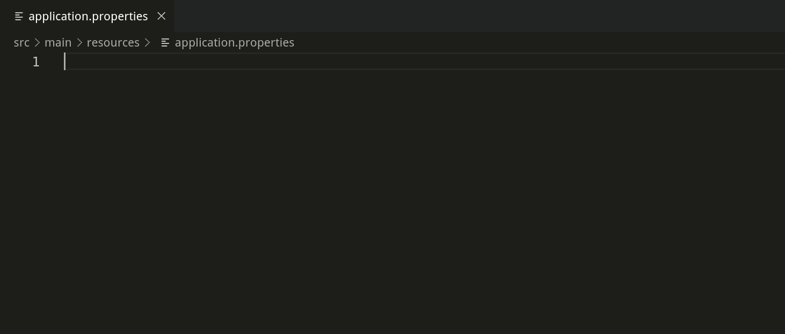

Quarkus Language Server (quarkus-ls)
===========================

The Quarkus language server is an implementation of the 
[Language Server Protocol](https://github.com/Microsoft/language-server-protocol), providing
language features for an application.properties file from a
[Quarkus](https://quarkus.io/) project.

The Quarkus language works alongside the
[Quarkus jdt.ls extension](https://github.com/redhat-developer/quarkus-ls/tree/master/quarkus.jdt)
which is also located in this repository. The Quarkus jdt.ls extension is able to index
a Quarkus project for metadata (config properties, documentation, sources, etc.) to provide the 
Quarkus language server the information required for the language features.
The relationship between the Quarkus language server and the Quarkus jdt.ls extension is explained 
in more detail in the 
[vscode-quarkus contributing guide](https://github.com/redhat-developer/vscode-quarkus/blob/master/CONTRIBUTING.md).

Features
--------------

* [textDocument/completion](https://microsoft.github.io/language-server-protocol/specifications/specification-3-14/#textDocument_completion)
* [textDocument/definition](https://microsoft.github.io/language-server-protocol/specifications/specification-3-14#textDocument_definition)
* [textDocument/documentSymbol](https://microsoft.github.io/language-server-protocol/specifications/specification-3-14/#textDocument_documentSymbol)
* [textDocument/hover](https://microsoft.github.io/language-server-protocol/specifications/specification-3-14/#textDocument_hover)
* [textDocument/publishDiagnostics](https://microsoft.github.io/language-server-protocol/specifications/specification-3-14/#textDocument_publishDiagnostics)

Demo
--------------
The following gif demonstrates the `textDocument/completion` request and response in Visual Studio Code.

Click [here](./demos/DEMO.md) to view a demo for the rest of the language features.

Building the Language Server
--------------
* Clone this repository
* Navigate to the `quarkus-ls/quarkus.ls` folder in your terminal or command line
* Run `./mvnw clean verify` (OSX, Linux) or `mvnw.cmd clean verify` (Windows)
* After successful compilation you can find the resulting `com.redhat.quarkus.ls-uber.jar` in the
`quarkus-ls/quarkus.ls/com.redhat.quarkus.ls/target` folder.

Clients
-------

Here are some clients consuming the Quarkus language server:

 * Eclipse with [quarkus-lsp4e (POC)](https://github.com/angelozerr/quarkus-lsp4e)
 * IntelliJ with [intellij-quarkus](https://github.com/jeffmaury/intellij-quarkus)
 * Visual Studio Code with [vscode-quarkus](https://github.com/redhat-developer/vscode-quarkus)