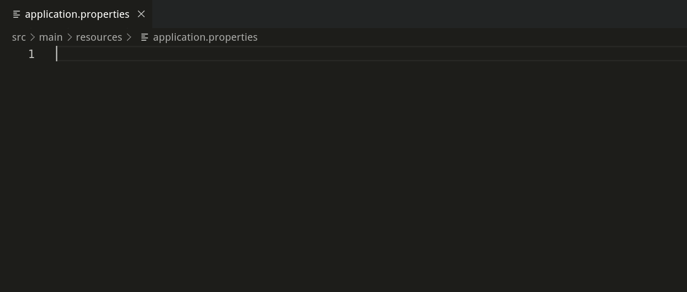
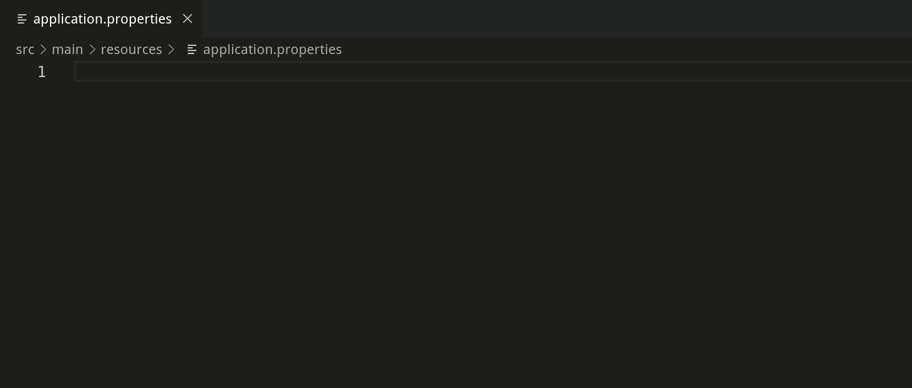
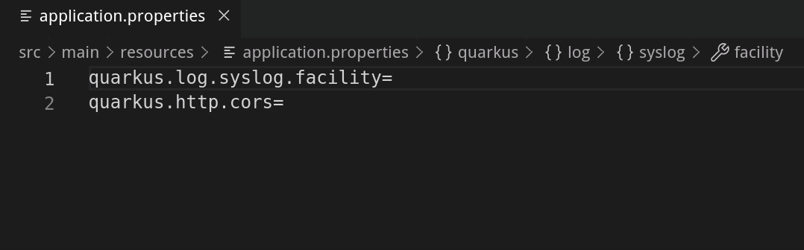
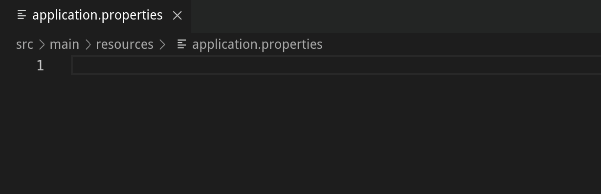
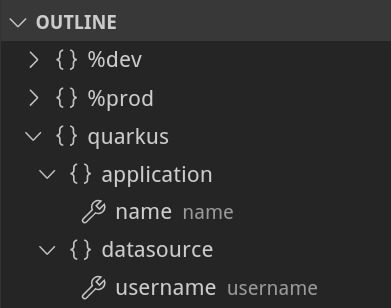
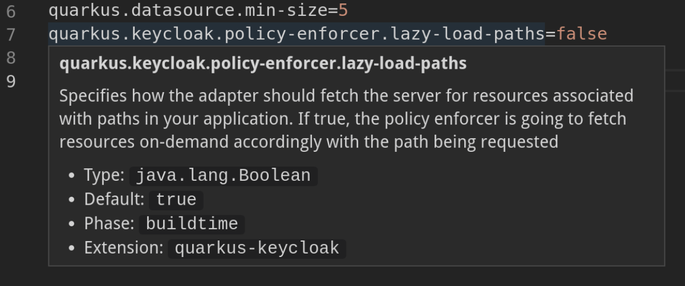
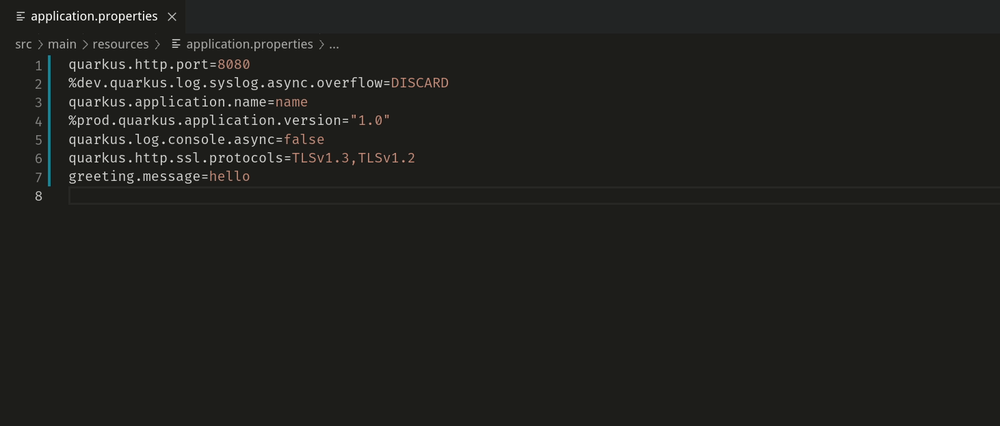
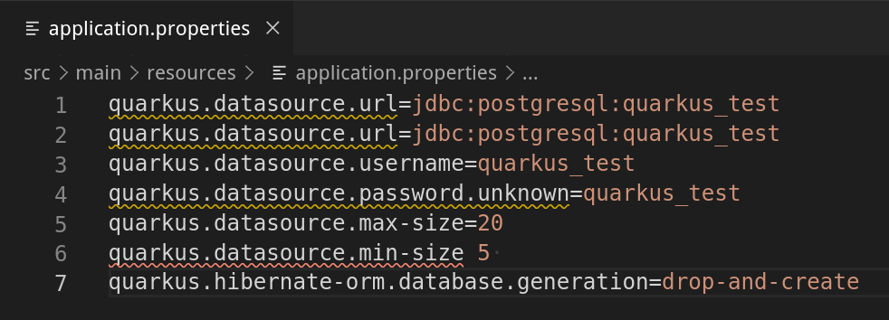

LSP Language Features Demo
===========================

textDocument/completion
--------------

#### Quarkus property key completion provided by the `textDocument/completion` request

#### Completion provides default value is exists

#### Quarkus property value completion for enumerated types and booleans

#### Completion can be returned as a snippet, if supported by the client

textDocument/definition
--------------
#### Goto Definition provided by `textDocument/definition` request

textDocument/documentSymbol
--------------
#### Document symbols provided by the `textDocument/documentSymbol` request

textDocument/hover
--------------
#### Hover supported provided by the `textDocument/hover` request

#### Hover support for Quarkus property keys and default profiles

textDocument/publishDiagnostics
--------------
#### Diagnostics supplied to client by `textDocument/publishDiagnostics` notification
#### Supported diagnostics:
* unknown properties
* duplicate properties
* missing equals signs

